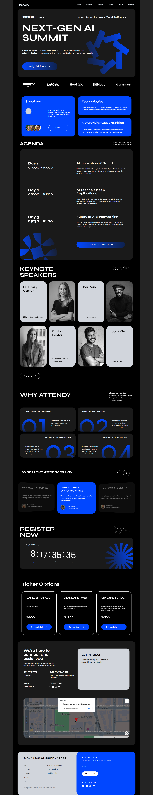

# 🚀 Landing Page v1.0.0

This repository contains the **first version (v1.0.0)** of the landing page project.  
Currently, it is a landing page built with **React + Vite + Tailwind CSS**.  

## 📌 Current Version
- **Version:** 1.0.0  
- **Status:** Initial release  
- **Features:**  
  - Basic responsive landing page layout  
  - Modern design with Tailwind CSS  

## 🔮 Future Plans
This is just the beginning! ✨  
Upcoming versions will include:  
- Dark mode support 🌙  
- Interactive components  
- Additional sections and animations  
- New features
- Performance optimizations  
- Other sectors

## 🛠️ Tech Stack
- **React** ⚛️  
- **Vite** ⚡  
- **Tailwind CSS** 🎨 


##  Getting Started

1. **Clone the repository & install dependencies**:
   ```bash
   git clone https://github.com/Farshadrm/react-tailwind-v1.0.0.git
   cd react-tailwind-v1.0.0
   npm install
   ```

2. **Start the development server**:
   ```bash
   npm run dev
   ```

---

## 📷 Preview
Here’s a preview of the landing page:  




## 📄 License
--

## Author

Made by Farshad-Rm
